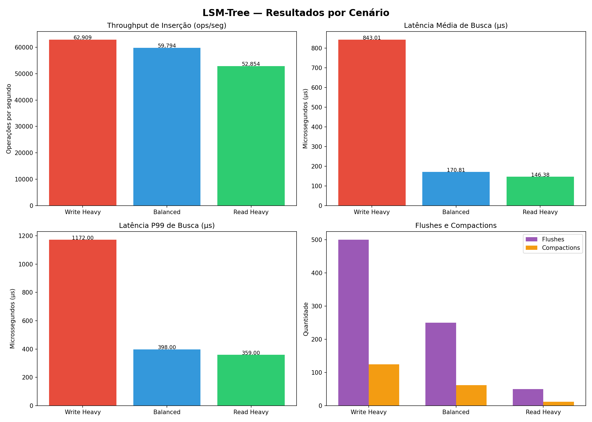

# lsm-tree-project

Esse repositório contém a implementação e experimentação de uma *LSM-Tree* (*Log-Structured Merge Tree*) em Java, com intuito de analisar diversas métricas sobre sua eficiência sob diferentes perfis de carga. Os cenários analisados são:
* Write Heavy — 500.000 inserções, 50.000 buscas
* Balanced — 250.000 inserções, 250.000 buscas
* Read Heavy — 50.000 inserções, 500.000 buscas

**Membros:**
- Luiz Marcelo Rabelo Borges da Costa Santos — Matrícula: 124211140
- Luizmar Varjão Tavares de Melo Neto — Matrícula: 124211089
- Filipe Costa de Morais — Matrícula: 124211867

## Introdução

A *LSM-Tree* (*Log-Structured Merge Tree*) tem seu uso consolidado na prática computacional por se configurar como uma estrutura especializada na organização e manutenção de dados em sistemas com alta taxa de escrita. A busca por estruturas de dados eficientes permite sistemas mais rápidos, facilita a manipulação de grandes volumes de informação sem perdas e maximiza o aproveitamento dos recursos de I/O. Esse tema torna-se relevante diante do crescimento constante no volume de dados, que exige soluções eficazes e escaláveis. Neste estudo, implementamos uma *LSM-Tree* do zero em Java 21, com todos os seus componentes fundamentais — *MemTable* baseada em Árvore Rubro-Negra implementada manualmente, *SSTables* persistidas em disco com índice de offsets e busca binária, e mecanismo de *compaction* em cascata por níveis — para avaliar a eficiência de suas operações de inserção e busca sob três cenários distintos de carga.

## Objetivo

O objetivo deste projeto é implementar os componentes fundamentais de uma *LSM-Tree* e avaliar experimentalmente o comportamento da estrutura sob três cenários distintos de carga: *write_heavy*, *balanced* e *read_heavy*. O estudo busca coletar e analisar métricas de throughput de inserção, latência de busca (média e P99), número de flushes e compactions para cada cenário, identificando como a estrutura se comporta conforme o perfil de acesso varia. Por fim, o objetivo é gerar uma base de análise que demonstre empiricamente o trade-off central da *LSM-Tree* entre alta performance de escrita e latência de leitura, contribuindo para a compreensão de sistemas que lidam com grandes volumes de dados intensivos em escrita.

## Como rodar o experimento?
```
docker compose --profile experiments up --build
```

Após a execução, os resultados estarão em `results/metrics/` (JSONs) e `results/graphs/` (gráfico PNG). Para gerar apenas os gráficos a partir de métricas já existentes:

```
docker compose --profile analysis up
```

## Metodologia

Nesse contexto, a execução do experimento se baseou no cumprimento de 3 etapas:

#### 1. Implementação dos componentes da LSM-Tree
#### 2. Geração das cargas de teste (workloads)
#### 3. Análise de desempenho sob os três cenários

1. Implementação dos componentes:

A *MemTable* foi implementada do zero como uma **Árvore Rubro-Negra** (*Red-Black Tree*), garantindo ordenação automática das chaves com inserção em O(log n) e travessia in-order para geração dos *sorted runs* durante o flush. A escolha da implementação manual, em vez do `TreeMap` nativo do Java, foi deliberada para consolidar o entendimento dos mecanismos internos de balanceamento — rotações e recoloração de nós.

A *SSTable* é um arquivo de texto imutável no disco onde cada linha representa um par `chave=valor` ordenado por chave. O `write()` persiste os dados da *MemTable* e gera simultaneamente um arquivo `.index` com os offsets de byte de cada linha. O `get()` carrega esse índice em memória **uma única vez** na primeira consulta à SSTable e o reutiliza em todas as buscas subsequentes, executando **busca binária** sobre as chaves em O(log n) e um único `seek` no arquivo `.sst` para recuperar o valor — eliminando o custo de varredura linear O(n) que seria necessário sem o índice.

A *LSMTree* coordena o ciclo completo: inserção na *MemTable* → flush para L0 quando cheia → compaction em cascata quando um nível atinge 4 SSTables. A compaction lê as SSTables do nível N+1 (dados mais antigos) e do nível N (mais recentes), faz o merge com deduplicação via `HashMap` — onde os dados do nível N sobrescrevem os do N+1 —, ordena o resultado e escreve uma nova SSTable consolidada no nível superior. Os arquivos antigos de ambos os níveis são então removidos do disco.

2. Geração das cargas de teste:

As cargas foram geradas pelo script `scripts/datagen/Generate.py`, com seed fixo (`random.seed(42)`) para garantir reprodutibilidade. O `BenchmarkRunner.java` utiliza `new Random(42)` pela mesma razão. Para cada cenário, são geradas operações PUT e GET na seguinte proporção:

| Cenário | Escritas | Leituras | MemTable Size |
|---|---|---|---|
| write_heavy | 500.000 | 50.000 | 4.000 chaves |
| balanced | 250.000 | 250.000 | 4.000 chaves |
| read_heavy | 50.000 | 500.000 | 4.000 chaves |

70% das buscas são por chaves existentes e 30% por chaves inexistentes (`key_missing_XXXXXXXX`), simulando o padrão típico de aplicações reais.

3. Análise de desempenho:

O `BenchmarkRunner.java` lê as configurações de variáveis de ambiente definidas no `docker-compose.yml` — `SCENARIO`, `NUM_KEYS` e `MEMTABLE_SIZE` — e executa as duas fases: inserção com medição de throughput total, e busca com medição de latência individual por operação. Cada container roda de forma isolada em seu próprio diretório `results/data/<cenário>`, eliminando race conditions entre containers paralelos. As métricas são salvas em JSON pelo `MetricsLogger.java` e visualizadas pelo script Python `plot_results.py`, que gera os gráficos comparativos em PNG.

## Resultados do Estudo de Desempenho (Benchmarks)

O objetivo desta análise é comparar a eficiência da *LSM-Tree* nas operações de inserção e busca sob os três cenários de carga. Os resultados são medidos em throughput (ops/s) e latência (μs).
<br><br>



1. **Métricas Chave e Dados Brutos**

> Os cenários comparados são: *write_heavy*, *balanced* e *read_heavy*. As métricas principais são throughput de inserção (ops/s), onde valores maiores indicam melhor desempenho, e latência de busca (μs), onde valores menores indicam melhor desempenho. O `MEMTABLE_SIZE` foi de 4.000 entradas para todos os cenários.

| Cenário | Chaves | Throughput (ops/s) | Latência Média (μs) | Latência P99 (μs) | Search Hits | Hit Rate | Flushes | Compactions |
|---|---|---|---|---|---|---|---|---|
| write_heavy | 500.000 | 37.436 | 122,67 | 291 | 35.000 | 70% | 125 | 31 |
| balanced | 250.000 | 60.489 | 110,76 | 304 | 175.000 | 70% | 63 | 15 |
| read_heavy | 50.000 | 61.958 | 88,37 | 263 | 350.000 | 70% | 13 | 3 |

2. **Análise de Desempenho por Operação**

    1. Desempenho de Inserção
        > Esta seção avalia a rapidez com que a estrutura processa operações de escrita.

        #### Interpretação da Inserção:
        O throughput de inserção revelou diferença expressiva entre os cenários. O *write_heavy* registrou 37.436 ops/s — significativamente inferior ao *balanced* (60.489 ops/s) e ao *read_heavy* (61.958 ops/s). Essa queda de aproximadamente 40% não é casual: o *write_heavy* realizou 31 compactions, cada uma exigindo a leitura e reescrita de um volume crescente de dados no disco — na última compaction, aproximadamente 496.000 chaves foram processadas simultaneamente em memória. Esse trabalho de reorganização bloqueia momentaneamente o fluxo de inserções, reduzindo o throughput médio observado.

        Os cenários *balanced* e *read_heavy* mantiveram throughput estável e próximo entre si (~61.000 ops/s), pois realizaram poucas compactions (15 e 3, respectivamente) — insuficientes para impactar de forma significativa o ritmo de inserções. Esse resultado confirma empiricamente o comportamento esperado da *LSM-Tree*: o custo de escrita cresce com o volume de dados e a frequência de compactions, não de forma linear com o número de inserções.

    2. Desempenho de Busca
        > Esta seção avalia a latência das operações de leitura nos três cenários.

        #### Interpretação da Busca:
        A latência de busca apresentou o gradiente esperado pela teoria da *LSM-Tree*: *write_heavy* (122,67 μs) > *balanced* (110,76 μs) > *read_heavy* (88,37 μs). O cenário com maior volume de escrita produz mais SSTables distribuídas pelos níveis L0 e L1, aumentando o número de arquivos que o `get()` precisa percorrer antes de encontrar ou descartar uma chave.

        O *hit rate* de exatamente 70% em todos os cenários confirma que todas as chaves inseridas sobrevivem corretamente na estrutura após os ciclos de flush e compaction — o merge entre níveis funciona como esperado, sem perda de dados. As 30% de buscas por chaves inexistentes (`key_missing_XXXXXXXX`) percorrem todos os arquivos SSTable sem encontrar resultado, contribuindo para elevar a latência média e especialmente o P99.

        O P99 do *balanced* (304 μs) ser ligeiramente superior ao do *write_heavy* (291 μs) é um resultado esperado: o *balanced* realiza 250.000 buscas — cinco vezes mais que o *write_heavy* — aumentando a probabilidade estatística de encontrar casos adversos que elevam o percentil 99.

    3. Relação entre Flushes, Compactions e Desempenho
        > O impacto do volume de escrita no comportamento interno da estrutura:

        A proporção de aproximadamente 4:1 entre flushes e compactions (125:31, 63:15, 13:3) é matematicamente consistente com o parâmetro `MAX_TABLES_PER_LEVEL = 4`: a cada 4 SSTables acumuladas em L0, uma compaction é disparada. Esse comportamento determinístico confirma o funcionamento correto do mecanismo de compaction em cascata.

        O *read_heavy* com apenas 3 compactions e 13 flushes mantém a estrutura enxuta — poucos arquivos em disco significam menos trabalho por busca, explicando sua menor latência. O *write_heavy*, com 125 flushes e 31 compactions, distribui os dados por mais arquivos e versões, elevando tanto o custo de inserção (compactions frequentes) quanto o de busca (mais arquivos a percorrer).

## Ameaças à validade

1. A implementação não utiliza **filtros de Bloom** por SSTable. Em sistemas de produção como RocksDB e LevelDB, esses filtros descartam em O(1) buscas por chaves inexistentes sem tocar o disco. Sem eles, as 30% de buscas por chaves inexistentes percorrem todos os arquivos SSTable de todos os níveis, inflacionando artificialmente a latência média e o P99 em todos os cenários.

2. O **formato texto** das SSTables (arquivo `.sst` com `chave=valor` por linha) é menos eficiente que formatos binários com blocos de tamanho fixo utilizados em produção. Isso impacta especialmente o tempo de compaction, que precisa parsear cada linha individualmente, e o tamanho dos arquivos no disco.

3. Os três containers Docker rodaram em **paralelo no mesmo host**, compartilhando CPU, memória e I/O de disco. Picos de carga de um container podem ter interferido nos demais, introduzindo ruído nas medições de latência. Para maior confiabilidade, cada cenário deveria ser executado isoladamente e em múltiplas rodadas, com os resultados agregados pela média.

4. O **JVM warmup** afeta os resultados, especialmente nos cenários com menos operações. O compilador JIT do Java não atinge sua otimização máxima nas primeiras centenas de operações, o que pode subestimar levemente o throughput real do *read_heavy* (50.000 inserções) em comparação com o *write_heavy* (500.000 inserções), onde o JIT teve mais tempo para otimizar o código durante a execução.

5. O índice de offsets é carregado **integralmente em memória** na primeira busca de cada SSTable e mantido durante toda a execução. Para SSTables muito grandes (L1 do *write_heavy* com ~496.000 entradas), esse índice ocupa dezenas de megabytes de heap. Em ambientes com memória limitada, esse comportamento pode pressionar o Garbage Collector e introduzir pausas não medidas.

## Considerações finais

Este estudo implementou e analisou experimentalmente os componentes fundamentais de uma *LSM-Tree* — *MemTable* como Árvore Rubro-Negra, *SSTables* com índice de offsets e busca binária, e compaction com merge completo entre níveis — demonstrando na prática o trade-off central da estrutura. O *write_heavy* confirmou que inserção intensa resulta em compactions frequentes e custosas, reduzindo o throughput de escrita (~37.000 ops/s contra ~62.000 nos demais cenários), enquanto o *read_heavy* demonstrou que poucos dados e poucas compactions produzem latências de busca menores (88 μs contra 123 μs no *write_heavy*). O *hit rate* de exatamente 70% em todos os cenários validou a corretude do mecanismo de compaction com merge completo entre níveis, garantindo que nenhuma chave é perdida ao longo dos ciclos de reorganização do disco. A principal limitação identificada em relação a implementações de produção é a ausência de filtros de Bloom, que tornaria as buscas por chaves inexistentes essencialmente gratuitas em termos de I/O — sendo este o próximo passo natural para evoluir a implementação.

## Referências

* O'Neil, P., Cheng, E., Gawlick, D., & O'Neil, E. (1996). *The Log-Structured Merge-Tree (LSM-Tree)*. Acta Informatica, 33(4), 351–385.
* Google. *LevelDB Implementation Notes*. Disponível em: https://github.com/google/leveldb/blob/main/doc/impl.md
* Meta (Facebook). *RocksDB Tuning Guide*. Disponível em: https://github.com/facebook/rocksdb/wiki/RocksDB-Tuning-Guide
